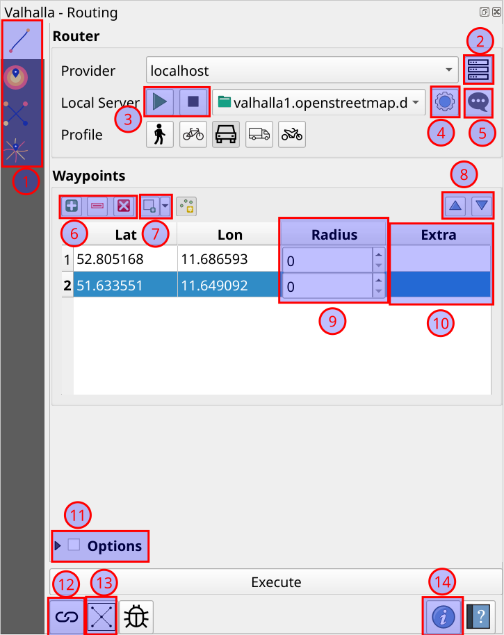

[](https://github.com/nilsnolde/valhalla-qgis-plugin/actions/workflows/ci-tests.yml) [](https://github.com/nilsnolde/valhalla-qgis-plugin/actions/workflows/ci-tests-latest.yml) [](https://coveralls.io/github/nilsnolde/valhalla-qgis-plugin?branch=master)

QGIS Plugin for the [Valhalla routing engine](https://github.com/valhalla/valhalla).

It features:
- UI & processing algorithms to routing, isochrones, matrix & expansion endpoints for `pedestrian`, `bicycle`, `car`, `truck` & `motorcycle`
- **all local** calculations after installing [`pyvalhalla-weekly`](https://pypi.org/project/pyvalhalla-weekly/) with the full flexibility of local Valhalla processes:
  - start a local server while reading from remmote graphs, e.g. a tar file on some server (only support HTTP basic auth)
  - build your own graph from a OSM PBF file
- support for most[^1] of Valhalla costing options in both UI & processing algorithms for **all endpoints**, e.g.
  - time-dependent routing
  - exclude polygons to avoid user-defined areas
  - and various other [costing options](https://valhalla.github.io/valhalla/api/turn-by-turn/api-reference/#costing-options)
- support for multiple Valhalla servers, the [public server](https://github.com/valhalla/valhalla?tab=readme-ov-file#demo-server) and `localhost` are preconfigured
- get extended graph information from the Valhalla server:
  - load the graph extent from a given instance (usually `localhost`) as a polygon layer
  - check for admins & timezone DBs
  - print Valhalla server version
  - print date of last graph update

> [!NOTE]
> Starting with `v3.0.0` this plugin had a complete re-write from scratch. Previously it was loosely based on one of my ex-plugins [ORS Tools](https://plugins.qgis.org/plugins/ORStools/), but that design has a quite a few shortcomings in terms of UX and aesthetics. The biggest problem is that the dialogs are huge and one can't properly access both the map canvas **and** the plugin at the same time. Starting with `v3.0.0` it's a docked plugin, i.e. arranging itself as a proper panel thanks to the awesome Qt/QGIS APIs.

[^1]: Some costing options make little sense, e.g. transit, some others we didn't get around to yet. Valhalla is also under constant development, we might miss a few recently added ones.

## How To

### Routing UI



1. Select the endpoint/action to "Execute". Note that some endpoints expect multiple waypoints.
2. Manage the servers which are shown in the "Provider" drop-down
3. Start or stop a Valhalla service on `localhost` with the local graph shown in the dropdown menu
4. Manage settings for the local setup, see ["Settings UI"](#settings-ui)
5. Watch logs for the local Valhalla service
3. Add/remove/clear waypoints in the table:

    - to add waypoints, click the "add" button and then in the map canvas. To end the adding session, either double-click in the map canvas or click the "add" button again.
    - to remove single/multiple waypoints, click rows in the waypoints table before clicking the "remove" button.
    - the "clear" button will remove _all_ waypoints from the table
4. Multiple alternatives to add waypoints to the table:

    - "From Point Layer": parses waypoints from the features of a user-specified point layer
    - "From Valhalla JSON": parses waypoints from a Valhalla `locations` request array (TODO: [#27](https://github.com/nilsnolde/valhalla-qgis-plugin/issues/27))
    - "From OSRM URL": parses waypoints from a OSRM GET request URL, also sets `bearing` etc in the "Extra" column
6. Moves the _selected_ waypoint rows up & down, also updates the "Valhalla waypoints" annotation layer
7. Set a radius for each waypoint which will snap more roads
8. Set extra Valhalla waypoint properties in URL query parameter form (i.e.`k1=v1&k2=v2`), e.g. `waiting=1800&date_time=2025-07-25T09:00`
9. Additional costing options to influence the path finding for _any_ endpoint
10. View the full most recent request, mostly useful when reporting issues, or debugging.
11. Check the remote graph for admin & timezone DBs (they should exist) and loads the graph extent of the currently set Valhalla server as a polygon layer (if available).
12. Some information about the plugin and (if available) the currently set Valhalla server.

### Settings UI


1. Change the parent directory of the local Valhalla executables; useful mostly for debugging
2. Defaults the binary directory back to the Python bindings one
3. Lets the user add graphs from mulitple sources:
    - from a tar file, e.g. built with one of [Valhalla's docker images](https://github.com/valhalla/valhalla/tree/master/docker)
    - from a URL, which could be a remote tar file or graph directory; also support HTTP basic auth
    - from a OSM PBF file, which will build the graph from scratch
4. Remove a local graph
5. Change the directory or disk for local graphs
6. Edit the Valhalla configuration which will control both the local graph build and the local service
7. View the local graph build logs
8. List of locally registered graphs available for `localhost`
9. A list of dependencies; currently only [`pyvalhalla-weekly`](https://pypi.org/project/pyvalhalla-weekly/) is supported. After plugin installation you can install the package from here. On QGIS startup it'll check if there's a new version available and let you update.

## Test

To run the tests, one needs a locally running Valhalla server with an Andorra graph, e.g.

```
docker run --rm -dt --name valhalla-router -p 8002:8002 -v $PWD/tests/data:/custom_files -e tileset_name=andorra-tiles ghcr.io/valhalla/valhalla-scripted:latest
```

### Local

`python -m unittest discover`

### Docker

In CI we run the tests with the QGIS docker image, have a look [there](.github/workflows/ci-tests.yml).

## History

Without going into too much detail, this plugin had once a **much** wider scope. Back when I was still running [GIS-OPS](https://github.com/gis-ops), I was a bit obsessed with providing an alternative to ESRI's network analyst, one of the last areas where QGIS is very very far behind ESRI. That's a crazy huge task, especially including all those optimization algorithms. However, we actually did come a pretty long way:

- support for both Valhalla & OSRM
- optimization support [`spopt`](https://github.com/pysal/spopt) and [`pyvroom`](https://pypi.org/project/pyvroom/) in the plugin UI
- support for **all local** calculations via
  - [`pyvalhalla`](https://pypi.org/project/pyvalhalla/)
  - [`py-osrm`](https://github.com/nilsnolde/py-osrm)

We were also planning to open a web shop where you could buy Valhalla & OSRM graphs right from QGIS and load them locally in a heartbeat. The idea was grand and a lot of OSS was being released as the result of it, e.g. the python bindings to Valhalla & OSRM and Windows support for `pyvroom`. Sadly the work to get there was grand as well and we never ended up releasing the full plugin.

The current Valhalla plugin still has all the source code though, mostly just commented out. In case anyone ever feels the urge to rival ESRI Network Analyst, please contact me on nilsnolde+github@proton.me.